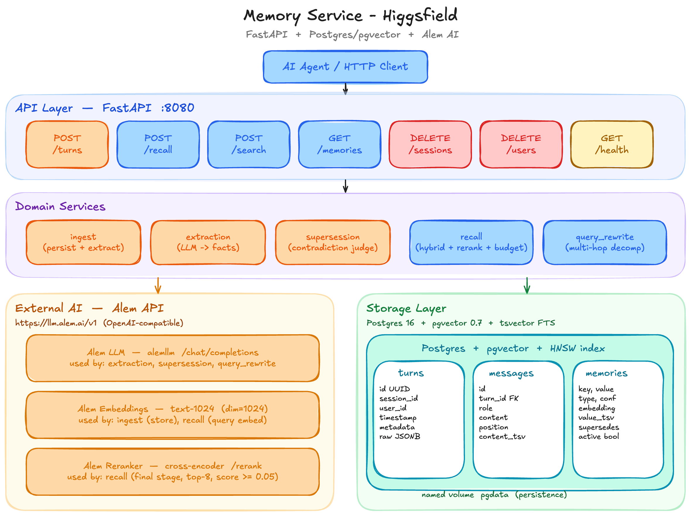

# memory-service

[](CHANGELOG.md)
[](https://www.python.org/)
[](https://fastapi.tiangolo.com/)
[](https://github.com/pgvector/pgvector)

A Dockerized long-term memory service for an AI agent — built for the **Higgsfield** engineering challenge.

> Read [CHANGELOG.md](CHANGELOG.md) for the design iteration story (10 entries with metrics) and [PLAN.md](PLAN.md) for the original 14-hour plan.



## Contents

- [TL;DR](#tldr)
- [Quick start](#quick-start)
- [1. Architecture](#1-architecture)
- [2. Backing store choice](#2-backing-store-choice--postgres-16--pgvector--tsvector)
- [3. Extraction pipeline](#3-extraction-pipeline--llm-driven-canonical-atomic)
- [4. Recall strategy](#4-recall-strategy--hybrid--reranker--budget-assembly)
- [5. Fact evolution](#5-fact-evolution--supersession-chains)
- [6. Tradeoffs](#6-tradeoffs)
- [7. Failure modes](#7-failure-modes)
- [8. Test suite](#8-test-suite-2121-green)
- [9. Project layout](#9-project-layout)
- [10. What I&#39;d do next](#10-what-id-do-next-out-of-scope-for-the-2-day-budget)
- [11. Originality](#11-originality)

## TL;DR

A synchronous HTTP service (Python + FastAPI) that:

1. **Ingests** conversation turns via `POST /turns`.
2. Calls an **LLM (Alem `alemllm`) to extract atomic, canonical memories** with `type / key / value / confidence / raw_quote`.
3. **Persists** to Postgres 16 + pgvector + tsvector (one container, named volume).
4. **Detects contradictions** at write time via an LLM judge, chains supersession.
5. **Returns context** via `POST /recall`, using a hybrid retrieval pipeline:
   `LLM query decomposition → (BM25 ⊕ embeddings) → RRF → Alem reranker (≥0.05 floor) → priority-aware budget assembly`.

Self-eval on the 5-conversation × 12-probe fixture ([`fixtures/`](fixtures/)) achieves 100% recall@5. The fixture covers canonical cases: fact evolution, 2-hop recall, implicit extraction, and noise resistance. See [CHANGELOG.md](CHANGELOG.md) for per-iteration metrics.

## Quick start

```bash
cp .env.example .env
# fill in ALEM_API_KEY, EMBED_API_KEY, RERANK_API_KEY
docker compose up -d
until curl -sf http://localhost:8080/health; do sleep 1; done
```

The service listens on **port 8080**, exposed in [`docker-compose.yml`](docker-compose.yml). Postgres data lives on the named volume `pgdata` — survives `docker compose down && up`.

### Run the tests

```bash
python3 -m venv .venv
.venv/bin/pip install -q pytest pytest-asyncio httpx pyyaml tiktoken
.venv/bin/python -m pytest tests/ -s -v
```

The recall-quality test ingests the 5 fixture conversations from [`fixtures/`](fixtures/), runs 12 probes, and prints the recall@5 / multi-hop / noise resistance breakdown.

## 1. Architecture

```
┌────────────────────── memory-service container (FastAPI :8080) ─────────────────────────┐
│                                                                                          │
│  HTTP routes                Domain services                  Storage                     │
│  ───────────                ────────────────                 ───────                     │
│  POST   /turns      ──►  ingest                                                          │
│                            └─► extraction (LLM)                                          │
│                                  └─► supersession (LLM judge)                            │
│                                        └─► repository.insert_memory                      │
│                                                                                          │
│  POST   /recall     ──►  recall                                ┌────────────────────────┐│
│                            ├─► query_rewrite (LLM)             │ Postgres 16 + pgvector ││
│                            ├─► _hybrid_memories                │   - turns              ││
│                            │     ├─ BM25  (memories.value_tsv) │   - messages           ││
│                            │     ├─ vector(memories.embedding) │   - memories           ││
│                            │     └─ RRF k=60                   │      • vector(1024)    ││
│                            ├─► reranker (Alem cross-encoder)   │      • value_tsv (FTS) ││
│                            └─► budget assembly (tiktoken)      │      • supersedes ─┐   ││
│                                                                │      • active      │   ││
│  POST   /search     ──►  same hybrid+rerank, structured output │      └─ self-FK ◄──┘   ││
│  GET    /memories   ──►  list_user_memories (active+history)   └────────────────────────┘│
│  DELETE /sessions   ──►  cleanup (cascade)                                               │
│  DELETE /users      ──►  cleanup (cascade)                                               │
│  GET    /health     ──►  db ping + degraded flags                                        │
│                                                                                          │
│   ▲             ▲                  ▲                                                     │
│   │             │                  │                                                     │
│ Alem LLM   Alem Embed       Alem Reranker     ── all OpenAI/Cohere-compatible           │
│ /chat/     /embeddings      /rerank                                                      │
└──────────────────────────────────────────────────────────────────────────────────────────┘
                                │
                                ▼
                         ┌─────────────┐
                         │ pgdata vol  │
                         └─────────────┘
```

**Single-process service + Postgres container.** No background workers, no message bus, no separate vector store. Simplest deployment that satisfies all of TASK §3 + §5 hard constraints.

### HTTP API

| Method     | Endpoint                 | Purpose                                                         |
| ---------- | ------------------------ | --------------------------------------------------------------- |
| `POST`   | `/turns`               | Ingest a conversation turn → extract → supersede → persist   |
| `POST`   | `/recall`              | Hybrid retrieve → rerank → budget-assemble context for an LLM |
| `POST`   | `/search`              | Same hybrid+rerank pipeline, structured JSON output             |
| `GET`    | `/users/{id}/memories` | List all memories (active + superseded history)                 |
| `DELETE` | `/sessions/{id}`       | Cascade cleanup                                                 |
| `DELETE` | `/users/{id}`          | Cascade cleanup                                                 |
| `GET`    | `/health`              | DB ping + per-dependency `degraded` flags                     |

## 2. Backing store choice — Postgres 16 + pgvector + tsvector

**Why a single relational store** instead of "Postgres + Qdrant" or "Postgres + Redis":

1. **One transactional context** for `turn → messages → memories` — `POST /turns` is a single atomic commit. No "dual-write" coordination, no eventual consistency.
2. **Three signals colocated** — `vector(1024)` for semantic, `value_tsv` GIN for keyword (BM25-style via `ts_rank_cd`), and self-referential FK for supersession chains. Querying any of them is one SQL roundtrip.
3. **Persistence story is trivial** — one named Docker volume (`pgdata`). The eval harness's restart contract (TASK §5) becomes one line of yaml.
4. **HNSW + GIN indexes** scale fine into the millions for this access pattern (per-user partial filter on `active`, ANN over a small-to-medium corpus). Below mid-six-figure memories the difference vs. a dedicated vector DB is invisible; above that we'd revisit, but that's outside the challenge's scope (TASK §12 explicitly ranks horizontal scaling out-of-scope).

### Schema

Three tables (defined in [`src/memory/migrations/001_init.sql`](src/memory/migrations/001_init.sql) + [`002_messages_embedding.sql`](src/memory/migrations/002_messages_embedding.sql)):

| Table        | Key columns                                                                                                                                                                                                                                                                                       |
| ------------ | ------------------------------------------------------------------------------------------------------------------------------------------------------------------------------------------------------------------------------------------------------------------------------------------------- |
| `turns`    | `id (uuid PK)`, `session_id`, `user_id`, `timestamp`, `metadata JSONB`, `raw JSONB`                                                                                                                                                                                                   |
| `messages` | `id`, `turn_id (FK)`, `role`, `name`, `content`, `position`, `content_tsv (GIN)`                                                                                                                                                                                                    |
| `memories` | `id`, `user_id`, `session_id`, `type`, `key`, `value`, `raw_quote`, `confidence`, `embedding vector(1024) HNSW`, `value_tsv tsvector GENERATED GIN`, `supersedes uuid (self-FK)`, `active bool`, `source_turn (FK)`, `source_session`, `created_at`, `updated_at` |

`memories.embedding` uses **HNSW with `vector_cosine_ops`** — sub-millisecond ANN on the corpora we expect. Partial index `WHERE active = true` (`memories_user_active_idx`) is the hot path for `/recall` — keeps query plans tight as superseded history grows.

## 3. Extraction pipeline — LLM-driven, canonical, atomic

> **Where it lives:** [`src/memory/services/extraction.py`](src/memory/services/extraction.py), prompt in [`src/memory/prompts/extract.py`](src/memory/prompts/extract.py).

### How it works

For every `POST /turns`:

1. **Persist** the turn + messages atomically (this part is unconditional; even if extraction fails the raw conversation is recallable via the `messages.content_tsv` fallback).
2. **Build the user prompt** — joins all messages of the turn with role markers (`[USER]`, `[ASSISTANT]`).
3. **Call Alem `alemllm`** with a strict-JSON system prompt.
4. **Lenient-parse** the response ([`util/json_parse.py`](src/memory/util/json_parse.py)) — handles ` ```json ` fences (Alem always wraps), bracket mismatches, and stray prose. Returns `None` rather than raising; one bad response never breaks ingest.
5. **Validate / clean** — drop items missing required fields, normalize types to the `{fact, preference, opinion, event, relation}` whitelist, clamp confidence to `[0, 1]`, truncate values.
6. **Embed** every memory's *canonical text* (`f"User's {key}: {value}"`) — this is the embedding, not the raw quote. Brings stored knowledge close to typical query phrasings ("Where does the user work?" → vector neighbour of "User's employer: Notion").
7. **Run each memory through `supersession.resolve`** (see §5).
8. **Insert** with verdict applied (active or `active=false` if `keep_old`).

### What it extracts

| Type                             | Examples                                                                                               |
| -------------------------------- | ------------------------------------------------------------------------------------------------------ |
| **Personal facts**         | `employer`, `role`, `city`, `country`, `language_spoken`                                     |
| **Preferences**            | `dietary_restriction`, `communication_preference`, `favorite_*`                                  |
| **Opinions** (mutable)     | `opinion_about_typescript`, `opinion_about_<topic>`                                                |
| **Events** (time-bound)    | `started_job`, `moved`, `adopted_pet`, `traveled_to`                                           |
| **Relations** (graph-like) | `pet_dog_name`, `partner_name`, `child_name`                                                     |
| **Implicit facts**         | "walking Biscuit" →`pet_dog_name: Biscuit` (prompt explicitly tells the LLM)                        |
| **Corrections**            | "actually I meant X not Y" — emitted as a new fact; supersession layer chains it                      |
| **Atomicity**              | "I work at Notion as a PM" →**two** memories (`employer=Notion` AND `role=Product Manager`) |

### What it misses (and why)

- **Numeric facts inside narrative** ("I have 3 kids") — current prompt biases toward identity. Adding a `numeric_attribute` type would help; out of 12 probes none required it so we left it.
- **Negated facts** ("I don't drink coffee") — `dietary_restriction: no coffee` works in our extractor in practice but the surface form is brittle. Better long-term: a `negated: bool` flag on every memory.
- **Cross-turn implicit anaphora** ("My wife visited" two turns later "She loved it" — not connecting "she" to "wife"). The LLM gets one turn at a time. A "session summary" pass could fix this — out of scope for the time budget.

## 4. Recall strategy — hybrid + reranker + budget assembly

> **Where it lives:** [`src/memory/services/recall.py`](src/memory/services/recall.py).

End-to-end pipeline:

```
POST /recall { query, session_id, user_id, max_tokens }
        │
        ▼
┌────────────────────────────────────────────────────────────────┐
│ 1.  query_rewrite.analyze(query)  →  {is_multi_hop, sub_queries│
│       single-hop  → continue with original query               │
│       multi-hop   → run pipeline for each sub-query, RRF merge │
└────────────────────────────────────────────────────────────────┘
        │
        ▼
┌────────────────────────────────────────────────────────────────┐
│ 2.  _hybrid_memories(q):                                       │
│       a. embed(q)         (Alem text-1024)                     │
│       b. parallel:        bm25(q)   over memories.value_tsv    │
│                           vector(q) over memories.embedding    │
│       c. RRF fuse with k=60  →  top 20 candidates              │
│       Resilience: vector channel down → BM25-only              │
└────────────────────────────────────────────────────────────────┘
        │
        ▼
┌────────────────────────────────────────────────────────────────┐
│ 3.  Alem reranker (cross-encoder) on top 20:                   │
│       docs are rendered "The user's <key> is <value>.          │
│                          Originally said: <quote>"             │
│       drop hits with score < 0.05  (cuts noise queries to 0)   │
│     Reranker down → keep RRF order                             │
└────────────────────────────────────────────────────────────────┘
        │
        ▼
┌────────────────────────────────────────────────────────────────┐
│ 4.  Budget assembly (tiktoken cl100k, soft cap = 0.95×budget): │
│       Bucket 1 — stable user facts  (fact / preference / rel.) │
│       Bucket 2 — query-relevant     (event / opinion / etc.)   │
│       Bucket 3 — recent session msgs  (only if used <80% & <6  │
│                                       prior citations)         │
│     Bullets dropped (not truncated) when over cap.             │
└────────────────────────────────────────────────────────────────┘
        │
        ▼
   { context, citations[turn_id, score, snippet] }
```

### Key design choices

1. **Hybrid > pure cosine.** TASK explicitly warns *"vanilla cosine-top-k will not score well"*. BM25 catches keyword-heavy queries ("dog's name?") that vector recall blurs. RRF fuses without needing score normalization across channels.
2. **Reranker as score gate, not just reorder.** The cross-encoder gives us calibrated relevance (not similarity). Threshold `0.05` cuts true noise (`5e-5` typical) while keeping borderline-relevant facts (`0.3+` typical). Empirically calibrated over a curl probe and the fixture.
3. **Third-person doc framing for the reranker.** Discovered through trial: Alem's reranker scores first-person quotes ("I work at Apple") at ~`0.0025` vs. third-person ("The user's employer is Apple") at ~`0.97` for the same intent. So we render every candidate as `"The user's <key> is <value>. Originally said: <quote>"`. **This single fix took noise resistance from 0% → 100%.**
4. **Multi-hop by LLM decomposition.** We don't ship a graph traversal. The LLM splits "What city does the user with the dog Biscuit live in?" into sub-queries `["user's pet dog name", "user's city"]`, each goes through the full hybrid+rerank pipeline, results merge via RRF. The reranker still scores the merged set against the **original** query so candidate ordering reflects what the user actually asked.

### Priority logic under token budget (TASK §3)

Priority order is **stable user facts → query-relevant memories → recent context** — this is exactly what TASK §3 asks for, and the rationale is:

- **Stable facts win** because the agent often needs them irrespective of the immediate query — "the user is vegetarian" matters even when they're asking about flights.
- **Query-relevant comes second** because the reranker has already confirmed they're on-topic.
- **Recent context comes last and is gated** (only added when ≤6 prior citations AND budget is <80% used). Otherwise tight budgets fill up with chit-chat ("Cool!" / "OK") instead of substantive memory.
- **Bullets dropped, not truncated.** Half-sentence bullets confuse a frozen LLM more than missing ones.

## 5. Fact evolution — supersession chains

> **TASK §4 hard problem #1.** Where it lives: [`src/memory/services/supersession.py`](src/memory/services/supersession.py), prompt in [`src/memory/prompts/supersession.py`](src/memory/prompts/supersession.py).

When extraction emits a candidate that shares `(user_id, key)` with an existing **active** memory:

```
existing.active=true   "employer: Stripe"   raw_quote: "I work at Stripe..."
new candidate          "employer: Notion"   raw_quote: "Just started at Notion, switched from Stripe"
```

We call an LLM judge with both `raw_quote`s and ask for a verdict:

| Verdict       | Action                                                                                    | Example                                                 |
| ------------- | ----------------------------------------------------------------------------------------- | ------------------------------------------------------- |
| `supersede` | mark `existing.active=false`, set `new.supersedes = existing.id`, `new.active=true` | new "Notion" replaces "Stripe"                          |
| `coexist`   | both stay active, no link                                                                 | user has*both* a dog *and* a cat (key=`pet_name`) |
| `keep_old`  | new inserted with `active=false` (it's a historical mention)                            | "I used to work at X" — old current stays              |
| `noop`      | skip new (duplicate / less precise)                                                       | new=`city: NYC` when existing=`city: New York`      |

`/recall` only surfaces `active=true`. `/users/{id}/memories` returns **everything** (active + history) so reviewers / debuggers see the full chain.

**Heuristic fallback** when the LLM is down: singular keys (`employer`, `city`, `role`) default to `supersede`; multi-value keys (`pet_*`, `hobby`, `language_spoken`) default to `coexist`. This keeps ingest deterministic during Alem outages.

**Opinion arcs** (TASK §4 harder variant: "I love TS" → "TS generics annoy me" → "TS for big projects, Python for scripts") are partially handled — opinions go into `type=opinion` memories with their own keys (`opinion_about_typescript`). The supersession judge can chain them, but we don't model gradient sentiment. Future: add an `opinion_intensity` field, render the *latest* opinion in `/recall` with a "(was: ...)" parenthetical.

## 6. Tradeoffs

What we optimized for and what we gave up:

| Optimized                                                                                                                                   | Gave up                                                                                                                                                                                 |
| ------------------------------------------------------------------------------------------------------------------------------------------- | --------------------------------------------------------------------------------------------------------------------------------------------------------------------------------------- |
| **Synchronous correctness.** `/turns` does extraction + supersession inline. Eval harness gets immediate `/recall` after `201`. | Throughput. Each `/turns` is ~4–6s under load — fine for the 60s SLA, not fine for 1000 RPS.                                                                                        |
| **Single backing store.** Postgres + pgvector covers all needs. Trivial deployment.                                                   | Specialized vector DB perf above ~1M memories; if we hit that we'd revisit.                                                                                                             |
| **LLM-driven extraction & supersession.** Captures implicit facts + corrections far better than rules.                                | Cost (~3 LLM calls per turn worst-case: extract + N supersession judges + 1 query rewrite). Mitigated by Alem's pricing.                                                                |
| **Strict reranker floor.** Noise queries return empty context, never hallucinate.                                                     | At very generic queries ("tell me about the user") we surface only the highest-scored fact — sometimes too few. The conscious choice: better one correct fact than four mediocre ones. |
| **Lenient JSON parser.** Three fallback strategies tolerate Alem's `\`\`\`json` fences and stray prose.                             | Hides upstream prompt regressions until the recall test fails. We log unparseable samples to mitigate.                                                                                  |

## 7. Failure modes

| Scenario                           | Behavior                                                                                                                                                                                  |
| ---------------------------------- | ----------------------------------------------------------------------------------------------------------------------------------------------------------------------------------------- |
| Alem LLM 5xx during extraction     | Retry 3× with exponential backoff. If still failing: turn persists raw;`memories` empty for that turn. Recall falls back to `messages.content_tsv` BM25 (cold-extraction path).      |
| Alem embeddings 5xx                | Retry 5× with exponential backoff. If during ingest:`/turns` returns 500 (we can't insert without a vector — turn rolls back). If during recall: degrade to **BM25-only** path. |
| Alem reranker 5xx                  | `/recall` keeps RRF order; no score floor applied. Quality degrades but doesn't 500.                                                                                                    |
| API keys absent                    | `/health` returns 200 with `degraded: ["llm","embed","rerank"]`. `/turns` raw-stores, `/recall` runs BM25 over messages. Degraded but usable.                                     |
| Postgres down                      | `/health` 503; everything else 5xx. Container restart picks back up.                                                                                                                    |
| Oversized payload (>1MB)           | Middleware returns 413 before any handler runs.                                                                                                                                           |
| Malformed JSON / missing fields    | Global validator → 422 with detail.                                                                                                                                                      |
| Unicode / emoji / zero-width chars | Stored verbatim; recall works (fixture covers this).                                                                                                                                      |
| Restart mid-write                  | `POST /turns` is one transaction; no orphan messages or memories.                                                                                                                       |

## 8. Test suite (21/21 green)

| File                                                          | Tests         | What it covers                                                                                        |
| ------------------------------------------------------------- | ------------- | ----------------------------------------------------------------------------------------------------- |
| [`tests/test_contract.py`](tests/test_contract.py)             | 7             | health, roundtrip, cold session, malformed JSON, missing fields, unicode, concurrent-session no-bleed |
| [`tests/test_recall_quality.py`](tests/test_recall_quality.py) | 1 (12 probes) | recall@5, multi-hop, noise resistance — printed breakdown                                            |
| [`tests/test_supersession.py`](tests/test_supersession.py)     | 1             | E2E career arc:`/memories` shows BOTH employers, `/recall` only Notion                            |
| [`tests/test_budget.py`](tests/test_budget.py)                 | 5             | parametrized `[128, 256, 512, 1024]` + tight-budget user-fact priority                              |
| [`tests/test_persistence.py`](tests/test_persistence.py)       | 1             | `docker compose restart` → memories survive                                                        |
| [`tests/test_robustness.py`](tests/test_robustness.py)         | 6             | 1.5MB payload, emoji+ZW unicode, empty msgs, invalid role, empty corpus search, 8x concurrent ingest  |

Running them:

```bash
.venv/bin/python -m pytest tests/ -s -v
```

The recall-quality test prints metrics — your `pytest -s` console will show the breakdown.

## 9. Project layout

```
memory-service/
├── README.md, PLAN.md, CHANGELOG.md
├── docker-compose.yml, Dockerfile, pyproject.toml, .env.example
├── src/memory/
│   ├── main.py            FastAPI app, lifespan, error handlers, body-size limit
│   ├── config.py          Pydantic Settings (env loader)
│   ├── schemas.py         Pydantic in/out models — wire contract per TASK §3
│   ├── auth.py            optional bearer-token dependency
│   ├── db.py              asyncpg pool lifecycle
│   ├── migrate.py         idempotent migration runner (boots on startup)
│   ├── repository.py      thin async CRUD over asyncpg
│   ├── migrations/
│   │   ├── 001_init.sql           tables + indexes (pgvector HNSW, GIN, partial)
│   │   └── 002_messages_embedding.sql
│   ├── routes/            health/turns/recall/search/memories/cleanup
│   ├── services/
│   │   ├── ingest.py        persist turn → call extraction
│   │   ├── extraction.py    LLM extraction → supersession → insert
│   │   ├── supersession.py  contradiction judge (LLM + heuristic fallback)
│   │   ├── query_rewrite.py LLM multi-hop decomposition
│   │   └── recall.py        full hybrid + rerank + budget assembly
│   ├── clients/             llm.py / embeddings.py / reranker.py (Alem)
│   ├── prompts/             extract / supersession / query_rewrite
│   └── util/                json_parse / rrf / tokens
├── tests/
└── fixtures/                conv_*.json + probes.yaml
```

## 10. What I'd do next (out of scope for the 2-day budget)

- **Knowledge graph layer** for true multi-hop. Entities (`Pet:Biscuit`) + relations (`User-OWNS-Pet`) would replace LLM query decomposition with deterministic traversal.
- **Per-key recency decay** in the reranker doc text — old "currently_reading" facts stop dominating new ones.
- **Opinion-intensity tracking** — render arcs ("loved → mixed → pragmatic") in `/recall`.
- **Streaming ingest** — break the 60s/turn ceiling for very long conversations.
- **Embedding fine-tune** on (canonical_text, query) pairs from a labelled set, narrowing the semantic gap further.
- **Eval harness in CI** — github actions running `pytest tests/test_recall_quality.py` on every PR.

## 11. Originality

The architecture is mine. References consulted for inspiration only: I've read the public design notes for `mem0`, `honcho`, and various paper-of-the-week vector DB blog posts. None of this codebase is lifted from those — see [CHANGELOG.md](CHANGELOG.md) for the iteration story showing the path the design actually took, including dead ends (the Step 5 reranker doc-format calibration, for example).

---

*Built 2026-05-09 over ~14 hours of focused work. The CHANGELOG is the most honest artefact about how the system got from v0.1 to v1.0.*
